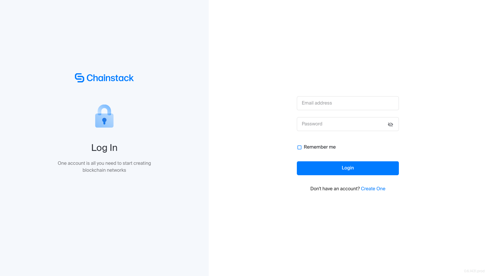
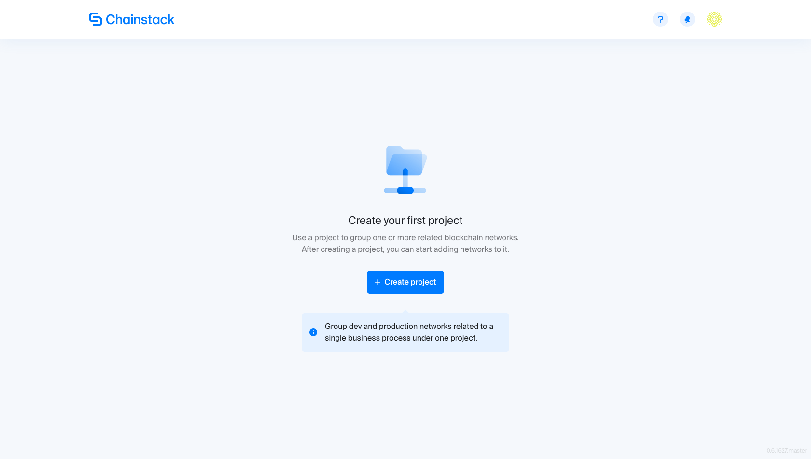
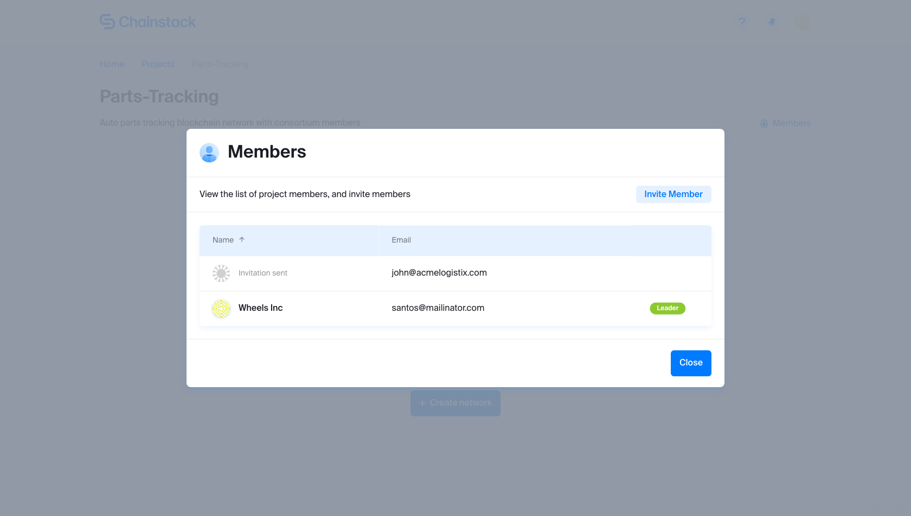
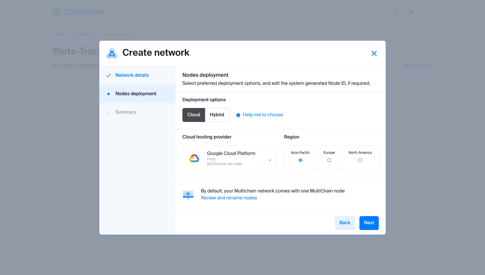
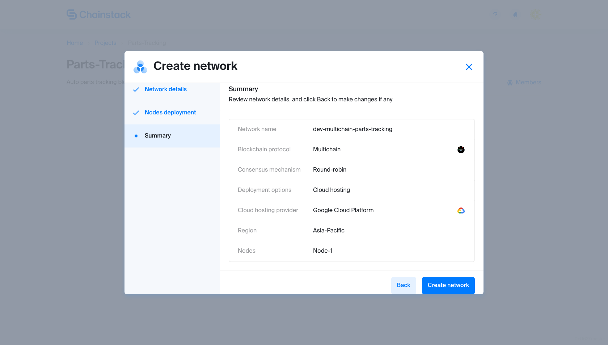
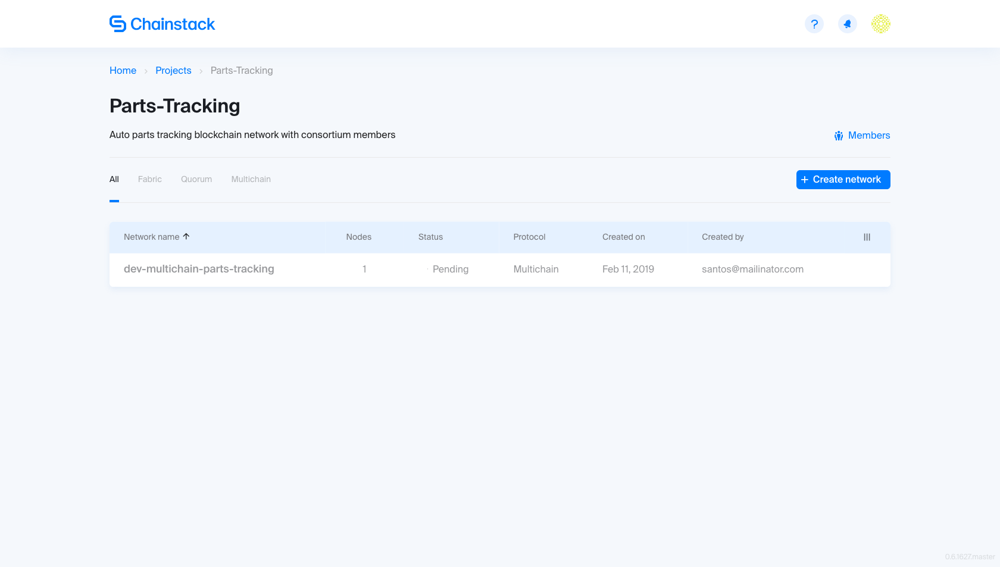

# Getting started

Get started with Chainstack in a few steps, and experience the ease of deploying a node on a protocol and cloud of your choice.

## Sign up

First things first, head to [Chainstack](https://console.chainstack.com/), and sign up.

Since this is your first time, you won't see any project. So let's start creating a project, and, even before that, understand why you need one.

## Create a project

On Chainstack, a project contains one or more blockchain networks related to a clearly defined business case. Creating a project is a prerequisite to creating a blockchain network.

For example, an organization may have development and production blockchain networks related to a single business case such as tracking of auto parts. In such a case, we recommend organizing both blockchain networks under one project called Parts-Tracking.

There are two types of projects:

**Consortium**
A Consortium project contains Fabric, MultiChain, Quorum, or private Ethereum networks deployed on a public cloud, on-prem, or hybrid infrastructure.

**Public chain**
A Public chain project contains Ethereum nodes deployed on the mainnet.

For this example, let's create a Consortium project by clicking _Create Project_ and choosing the _Consortium_ option from under the _Select Project Type_ drop-down. Enter _Parts-Tracking_ and _Auto parts tracking blockchain network with consortium members_ into _Name_ and _Description_ fields respectively, and click _Create_.

You have just created your first Consortium project, but it means nothing unless you have invited another member organization to collaborate with you and launched a a blockchain node. Let's continue.

## Invite a member

If you are simply tinkering with the platform and don't have a member yet to invite to your newly created consortium, you can skip to the next step **Create Network**.

If not, click the newly created project card, click _Member_, and then _Invite Members_. Enter the email address of the person, who will collaborate with you on the Parts-Tracking project, and click _Send_. This triggers an email invite to the recipient. Once accepted, the recipient will be listed in your members list. For now though, you will see an _Invitation sent_ status to the invited member.

## Create network

So you have created a project, Parts-Tracking in our case, and, perhaps, invited a member or two in the previous step. To create a network, click _Create Network_. The _Create Network_ wizard opens in a modal.

There are two steps to creating a network, well three, if you include the last step, which is a review of all the details entered. Let's go through them one by one.

### Network details

For starters, let's assume you want to test a Multichain blockchain network. Enter the following network name: dev-multichain-parts-tracking. Select Multichain from the Blockchain Protocol drop-down. Consensus mechanisms applicable to the protocol will be displayed below.

In the case of Multichain, there is no need to choose any consensus protocol. Chainstack automatically selects the default one, which is, Round-robin. If you were to choose Quorum, however, two protocols IBFT and Raft would have been displayed. Not sure which one to choose? Chainstack provides a helpful link _Help me to choose_ that takes you to an extensive guide in our documentation.

### Nodes deployment

Coming back to our MultiChain network, click _Next_ to view _Nodes deployment_. Chainstack automatically creates a default node, which you can view and rename. But we are jumping the gun here. Since a node has already been created in the background, all we need to do is to specify whether the node should be deployed on the cloud or in a hybrid environment. If cloud, specify the cloud provider.

Let's select _Cloud_ and _GCP_ from under the _Deployment options_ and _Cloud hosting provider_ sections as well as the specific _Region_.

### Summary

Click _Next_ to review your network and node details. If there are no changes, click _Create Network_.

This takes you back to the _Parts Tracking_ project page with all its networks. At the moment, we can see the first network _dev-multichain-parts-tracking_. Your first blockchain node will display a _Running_ status. Once the node status changes to _Running_, you can click it to view the node details.

## Next steps

Congratulations! You successfully created a Multichain network with a single node and, perhaps, already set the state for collaboration by inviting a member. Either way, all it took was a few minutes.

As a next step, we recommend you go through our [application development guide](/guides/application-development).
