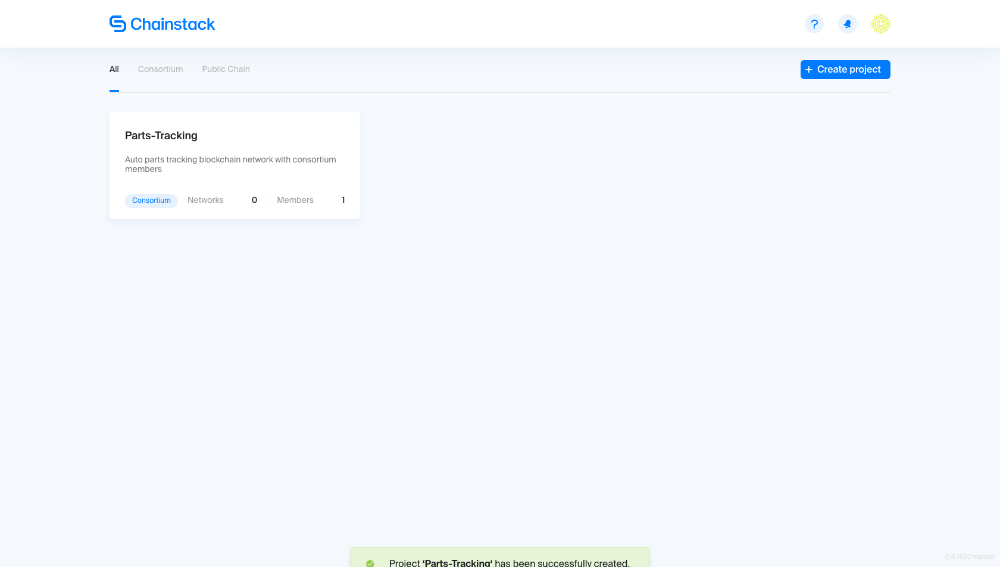
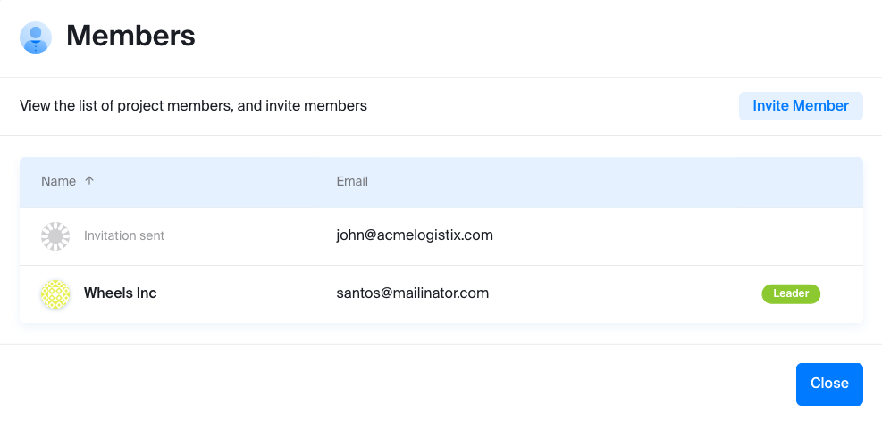
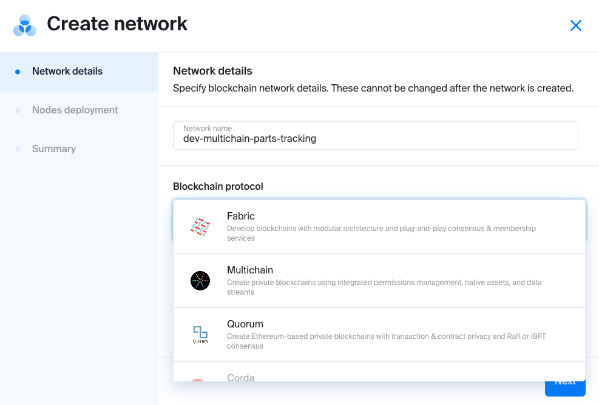
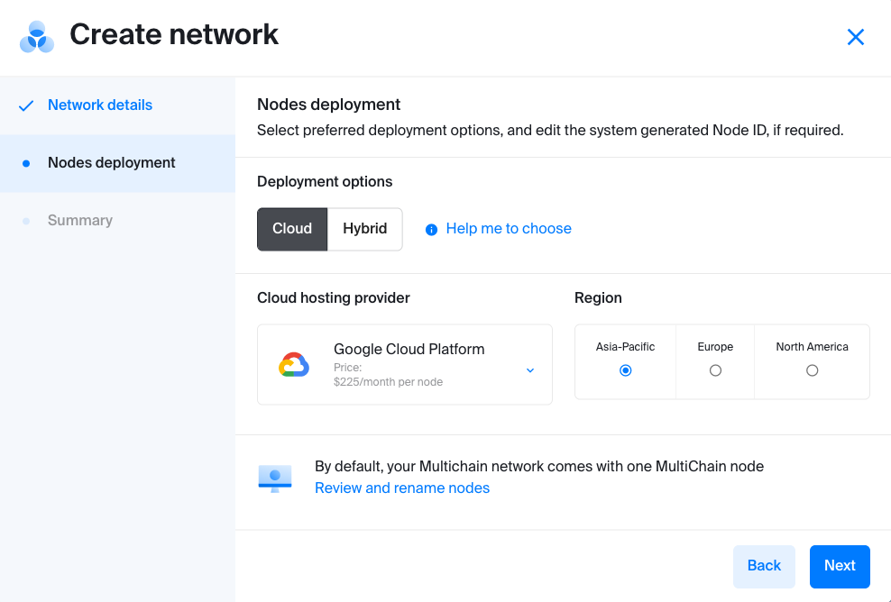
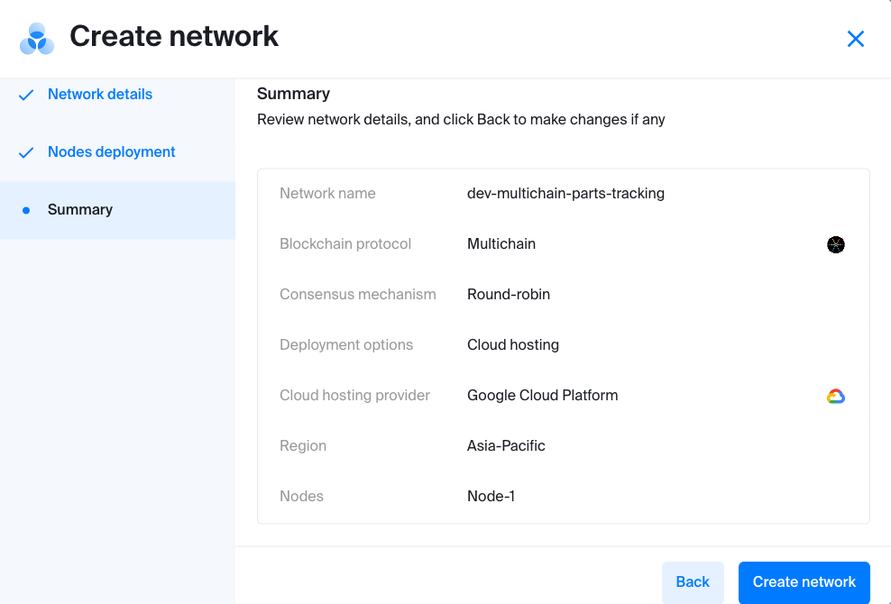
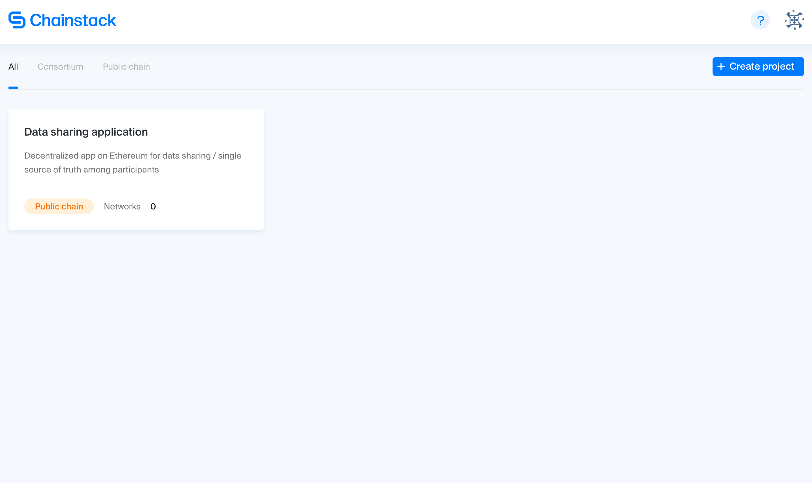
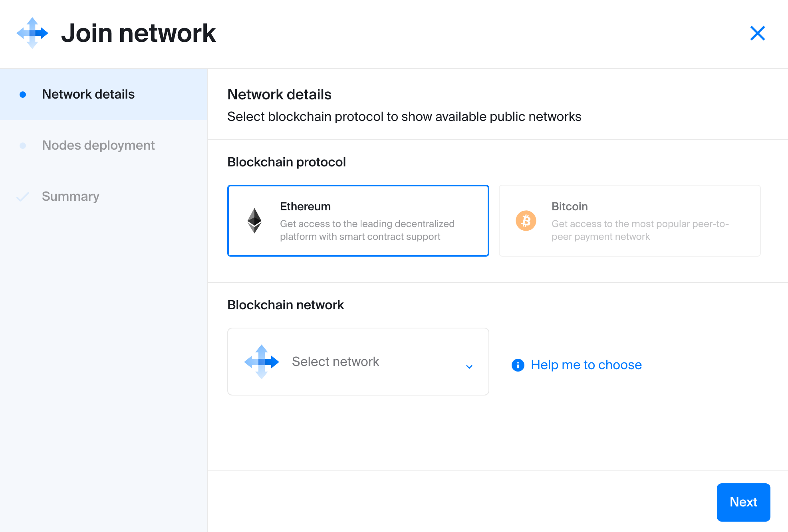
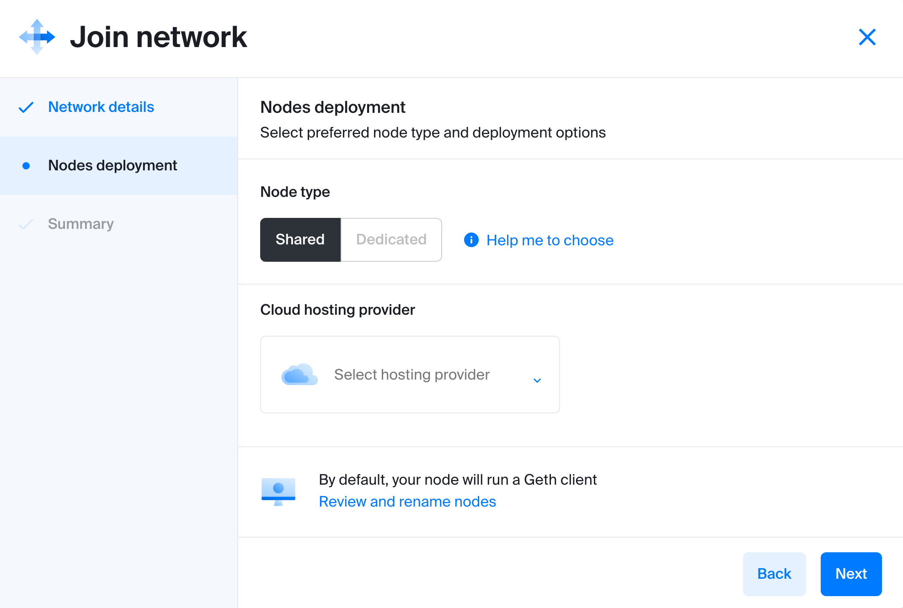
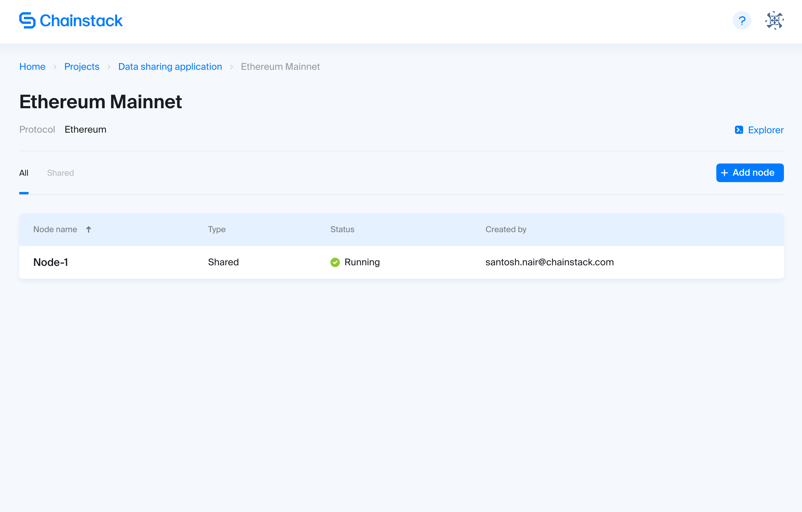
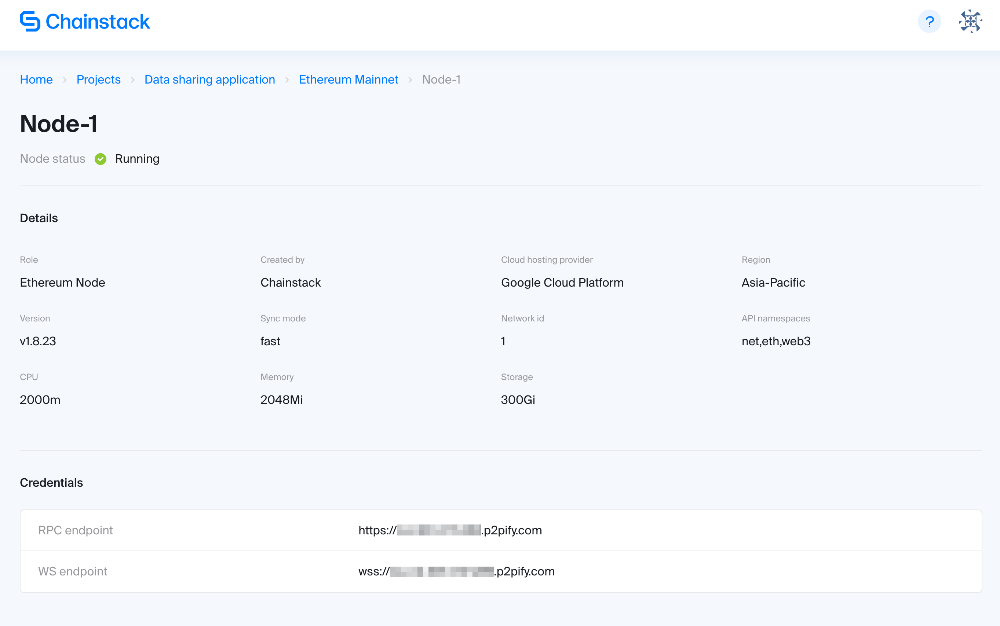

# Getting started

Get started with Chainstack in a few steps, and experience the ease of deploying a node on a protocol and cloud of your choice.

## Sign up

First things first, head to [Chainstack](https://console.chainstack.com), and sign up.

Since this is your first time, you won't see any project. So let's start creating a project, and, even before that, understand why you need one.

On Chainstack, a project contains one or more blockchain networks related to a clearly defined business case. Creating a project is a prerequisite to creating or joining a blockchain network.

For example, an organization may have development and production blockchain networks related to a single business case such as tracking of auto parts. In such a case, we recommend organizing both blockchain networks under one project called _Parts-Tracking_.

There are two types of projects:
- In a [consortium](/projects/consortium) project, multiple organizations can operate consortium networks based on [MultiChain](/blockchains/multichain) or [Quorum](/blockchains/quorum) protocols
- In a [public chain](/projects/public-chain) project, your organization can operate public Ethereum nodes

## Create a consortium

Let's create a consortium project by clicking **Create Project** and choosing the **Consortium** option from under the **Project type** drop-down. Enter _Parts-Tracking_ and _Auto parts tracking blockchain network with consortium members_ into the **Project name** and **Description** fields respectively, and click **Create**.

You have just created your first consortium project, but it means nothing unless you have invited another member organization to collaborate with you and launched a blockchain node. Let's continue.

### Invite a member

If you are simply tinkering with the platform and don't have a member yet to invite to your newly created consortium, you can skip to the next step.

If not, click the newly created project card, click **Members**, and then **Invite member**. Enter the email address of the organization representative, who will collaborate with you on the **Parts-Tracking** project, and click **Send**. This triggers an email invite to the recipient. Once accepted, the recipient will be listed in your members list. For now though, you will see an **Invitation sent** status to the invited member.

### Create a network

So you have created a project, **Parts-Tracking** in our case, and, perhaps, invited a member or two in the previous step. To create a network, click **Get started**. The **Create network** wizard opens in a modal window.

For starters, let's assume you want to test a MultiChain blockchain network. Enter the following network name: **dev-multichain-parts-tracking**. Select **MultiChain** from the **Blockchain protocol** drop-down. Consensus mechanisms applicable to the protocol will be displayed below.

In the case of MultiChain, there is no need to choose any consensus protocol. Chainstack automatically selects the default one, which is, **Round-robin**. If you were to choose Quorum, however, **Raft** and **IBFT** would have been displayed. Not sure which one to choose? Chainstack provides a helpful **Learn more** link that takes you to an extensive guide in our documentation.

### Deploy nodes

Coming back to our MultiChain network, click **Next** to view **Nodes deployment**. Chainstack automatically creates a default node, which you can view and rename. But we are jumping the gun here. Since a node has already been created in the background, all we need to do is to specify whether the node should be deployed on the cloud or in a hybrid environment. If cloud, specify the cloud provider.

Let's select **Cloud** and **Google Cloud Platform** from under the **Deployment options** and **Cloud hosting provider** sections as well as the specific **Region**.

Click **Next** to review your network and node details. If there are no changes, click **Create network**.

This takes you back to the **Parts-Tracking** project page with all its networks. At the moment, we can see the first network **dev-multichain-parts-tracking**. Your first blockchain node will display a **Running** status. Once the node status changes to **Running**, you can click it to view the node details.

Congratulations! You successfully created a MultiChain network with a single node and, perhaps, already set the stage for collaboration by inviting a member. Either way, all it took was a few minutes.

## Run a public blockchain node

Create a public chain project by clicking **Create project** and choosing the **Public chain** option from under the **Project type** drop-down. Enter _Data Sharing Application_ and _Decentralized app on Ethereum for data sharing / single source of truth among participants_ into the **Name** and **Description** fields respectively, and click **Create**. You have just created your first public chain project. 

### Join a network

But this is just a beginning. To join a public chain network, Ethereum, in this case, click the project listing to view the **Join network** modal window. 

Select **Ethereum** from **Blockchain protocol**. Network options available under the specific blockchain protocol are visible under **Blockchain network**. Select **Mainnet**.

Click **Next** to view the **Nodes deployment** section.

### Deploy nodes

On the **Nodes deployment** screen, select the **Node type**. You can learn more about **Shared** or **Dedicated** nodes by clicking **Help me to choose**. Select your **Cloud hosting provider** and **Region**.

Click **Next** to view the **Summary** section. Review the information, and click **Join network**.

That's it. It will take a few minutes, but once the node **Status** changes from **Pending** to **Running**, it's an indication that you have joined the Ethereum network.

Click the _Node name_ to view its details. This is where you will find the credentials required to interact with the node and build your first decentralized application.

## Next steps

Now it's the most fun part! Start [interacting with the blockchain](/guides/interacting-with-the-blockchain) and [developing the applications](/guides/application-development) using the node credentials obtained.