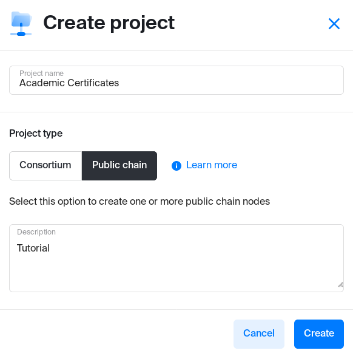
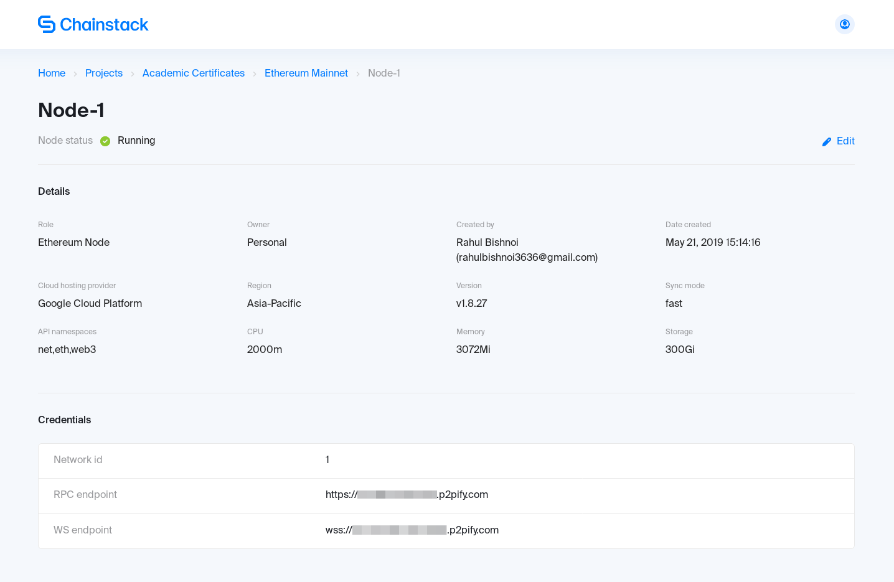

# Academic certificates on Ethereum

In this tutorial you will:

* Create a DApp that generates an academic certificate.
* Deploy the DApp on a public Ethereum node using Chainstack.

## Prerequisites

- Git
- [Truffle](https://truffleframework.com)
- [Chainstack](https://console.chainstack.com/) account

## Deploying a node

To begin, you will need a Chainstack account, which you can create for free [here](https://console.chainstack.com/user/account/create).

After creating an account, move to [the console](https://console.chainstack.com), click *Create project*, and fill out your project details:



You can see the created project on your dashboard. Now, deploy the Ethereum node:
1. Choose your project and click on **Get started** to join the network.
2. At the next step, choose **Node type** based on your requirements: you can decide whether you want a shared node (used by multiple Chainstack users) or a dedicated one (created exclusively for you)
3. Choose any cloud hosting provider.
4. Join network.

Great! You have deployed a node on Ethereum mainnet. Click on it to see node details:



You can see the **RPC endpoint**. We will need it later to connect to our node.

## Creating and compiling a DApp

First you need a boilerplate application. Go to any empty directory and run `truffle init` to set up a project. The directory structure will look like this:

```
.
├── contracts
│   └── Migrations.sol
├── migrations
│   └── 1_initial_migration.js
├── test
└── truffle-config.js
```

Go to the *contracts* directory and create two files: `Ownable.sol` and `DocStamp.sol`.

``` js
// Ownable.sol

pragma solidity ^0.5.0;

contract Ownable {
  address public owner;
  event OwnershipTransferred(address indexed previousOwner, address indexed newOwner);

  constructor() public {
    owner = msg.sender;
  }

  modifier onlyOwner() {
    require(msg.sender == owner);
    _;
  }

  function transferOwnership(address newOwner) onlyOwner public {
    require(newOwner != address(0));
    emit OwnershipTransferred(owner, newOwner);
    owner = newOwner;
  }
}
```

This is an ownable contract. It is implemented in the following way:

* Only an authority can generate a certificate. On contract deployment, the authority is the account that deploys the contract. The authority is the contract owner.
* The contract owner can transfer their authority.

``` js
// DocStamp.sol

pragma solidity ^0.5.0;

import './Ownable.sol';

contract DocStamp is Ownable {
  mapping (bytes32 => address) public records;

  event CertificateIssued(bytes32 indexed record, uint256 timestamp, bool returnValue);

  function issueCertificate(string calldata name, string calldata details) external onlyOwner {
    bytes32 certificate = keccak256(abi.encodePacked(name, details));    
    require(certificate != keccak256(abi.encodePacked("")));
    records[certificate] = msg.sender;
    emit CertificateIssued(certificate, block.timestamp, true);
  }

  function owningAuthority() external view returns (address) {   
    return owner;
  }

  function verifyCertificate(string calldata name, string calldata details, bytes32 certificate) external view returns (bool) {
    bytes32 certificate2 = keccak256(abi.encodePacked(name, details));
    // are certificates the same?
    if (certificate == certificate2) {
      // does the certificate exist on the blockchain?
      if (records[certificate] == owner) {
        return true;
      } 
    }
    return false;
  }
}
```

This is our main contract. It will handle the generation and verification of certificates.

- `issueCertificate()` generates a certificate by calculating a hash of student name and details.
  - Can be called only by the owner.
  - Emits a certificate generation event with a timestamp.
  - Issuer put the certificate on the blockchain by storing it in the global variable `records` by passing `records[certificate] = msg.sender`.
- `owningAuthority()` returns the address of issuer/authority.
- `verifyCertificate()` calculates a hash of student name and details and checks if it is on the blockchain.
  - Can be called by anyone.

After writing our contracts, create `2_deploy_contracts.js` in the `migrations` folder:

``` js
var DocStamp = artifacts.require("./DocStamp.sol");

module.exports = function(deployer) {
  deployer.deploy(DocStamp);
};
```

::: tip
Since **DocStamp** inherits from **Ownable**, **Ownable** will be deployed together with **DocStamp**.
:::

Let's compile our contracts using `truffle compile`. You will see a new directory `build/contracts` containing all our contracts in json format.

The contracts have been successfully compiled. Now we will deploy them to the blockchain.

## Deploying the DApp

First run `npm i truffle-hdwallet-provider` to install *hdwallet-provider* which will help you connecting to the Ethereum node.

Edit `truffle-config.js` to specify the mnemonic phrase and connection details to the mainnet node deployed on Chainstack:

``` js
const HDWalletProvider = require('truffle-hdwallet-provider');
const mnemonic = 'misery walnut expose ...';

module.exports = {
 networks: {
    development: {
        host: "127.0.0.1",
        port: 9545,
        network_id: "5777"
    },
    mainnet: {
        provider: () => new HDWalletProvider(mnemonic, "https://nd-123-456-789.p2pify.com"),
        network_id: 1,
        gas: 4500000,
        gasPrice: 10000000000
    }
   }
};
```
For development and testing purposes, we will deploy our DApp to the local network first.

Run `truffle dev` to get inside Truffle Develop running a local development blockchain. Deploy the DApp using the `migrate` command. You will see the contract address and gas used, the account from which they were deployed, and other details.

::: warning
If you are deploying to Ethereum mainnet, you will have to use real ether. Run `truffle migrate --network mainnet` to deploy the DApp using your Chainstack node.
:::

## Interacting with the DApp

You can interact with your contract through Truffle Develop, by writing tests or using a live mainnet deployment.

### Truffle Develop

Before interacting with the contract, ensure you have Truffle Develop console with the migrated contracts running.

1. Creating instance

``` js
> let instance = await DocStamp.deployed()
```

- You are creating an `instance` object of your deployed contract
- Enter `instance` to see your contract object ABI, bytecode, methods and so on

::: tip
You can see methods defined in **Ownable** on instance since **DocStamp** inherits from it.
:::

2. Interacting with instance

``` js
// get the contract owner
> let owner = await instance.owningAuthority()
// issue a certificate
> let result = await instance.issueCertificate("rahul", "developer", {from: owner})
// will fail if called by someone else 
> let result = await instance.issueCertificate("peter", "copywriter", {from: accounts[1]})
// verify certificate
> let verified = await instance.verifyCertificate("rahul", "developer", "0x3893c7e8b4091794fa54e4b22cc506042f2b00e07d965aa3927aff7f12163955", {from: owner})
```

- `owner` is the owning authority
  - The contract is deployed using `accounts[0]` by default which makes it the authority. See the constructor of **Ownable** and you will understand why!
- `result` is a transaction object since we change the state on the blockchain through a transaction.
  - `issueCertificate()` generates a certificate and emits an event showing that.
  - If you try to issue a certificate from an non-authority account like `accounts[1]`, the transaction will be reverted.
- `verified` returns *true* or *false* depending on the details you entered.

### Truffle tests

Let's go to the `test` directory now and write some tests to check if our contracts are working properly. Create a file called `test.js`:

``` js
const DocStamp = artifacts.require('./DocStamp.sol')

contract('DocStamp', function(accounts) {
  it('should issue a certificate', async function() {
    const account = accounts[0]

    try {
      const instance = await DocStamp.deployed()
      await instance.issueCertificate("rahul", "developer")
      const authority = await instance.owningAuthority()

      assert.equal(authority, account)
    } catch(error) {
      assert.equal(error, undefined)
    }
  })

  it('should verify a certificate', async function() {
    const account = accounts[0]

    try {
      const instance = await DocStamp.deployed()
      const verified = await instance.verifyCertificate("rahul", "developer", "0x3893c7e8b4091794fa54e4b22cc506042f2b00e07d965aa3927aff7f12163955")
      
      assert.equal(verified, true)
    } catch(error) {
      assert.equal(error, undefined)
    }
  })
}) 
```

To execute the tests, type `test` in Truffle Develop or simply run `truffle test` from the console.

::: tip
Tests in Truffle follow a general template which can be found [here](https://truffleframework.com/docs/truffle/testing/writing-tests-in-javascript).
:::

### Mainnet

::: warning
You should deploy your contracts to mainnet using Chainstack node before.
:::

To interact with the contracts deployed using Chainstack node, you need to create the a web3 provider with **RPC endpoint** of the node:

``` js
const Web3 = require('web3')
const web3 = new Web3('https://nd-123-456-789.p2pify.com')
```

After creating your `web3` object, you can call different web3 methods to interact with the deployed contracts. Check [this tutorial](http://www.dappuniversity.com/articles/web3-js-intro) to know more and also read [web3 docs](https://web3js.readthedocs.io/en/1.0/web3-eth.html). 

## Summary

In this tutorial, we learned how to create a simple DApp for Ethereum, test it locally, and deploy to the mainnet using a node running on Chainstack.

::: tip
Full code for the DApp used in this tutorial can be found [here](https://github.com/chainstack/ethereum-certificates-tutorial).
:::
