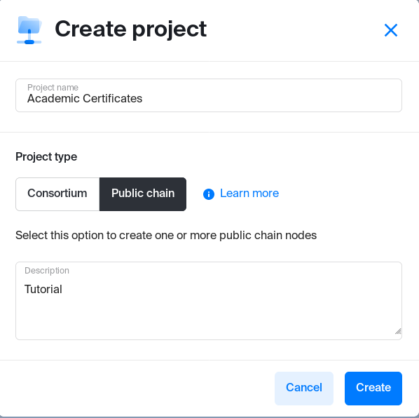
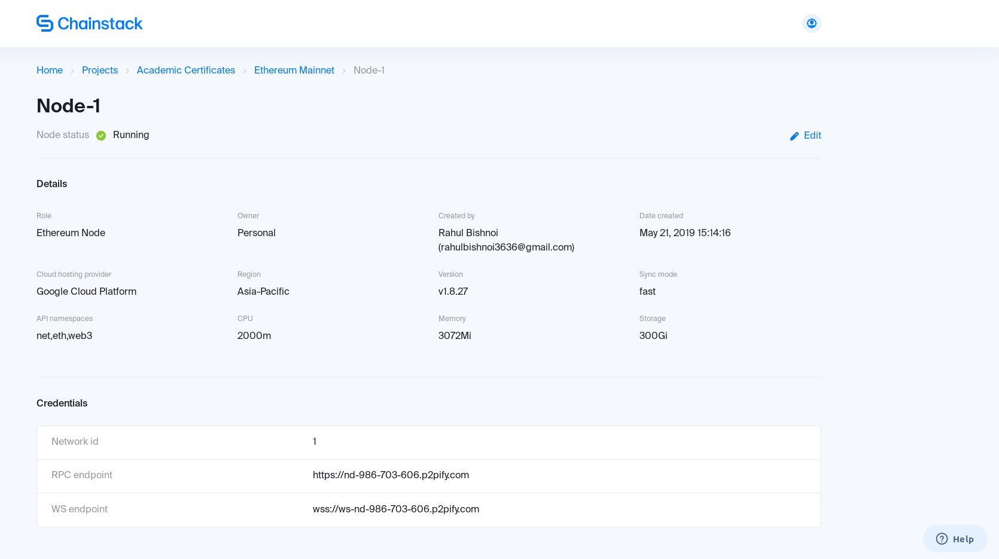

# Academic Certificates on Ethereum

In this tutorial we'll be writing a academic certificate generating dapp and will deploy it on public ethereum node using chainstack.

Let's begin!!

## Prerequisites
- Git
- Truffle
- Chainstack account

## Deploying a node
To begin you'll need a chainstack account (free or on any paid plan), to know how to get a free chainstack account follow these [steps](https://docs.chainstack.com/guides/getting-started)

So after creating an account move to [https://console.chainstack.com/](https://console.chainstack.com/) and there you'll see "Create project", click on it to create a new project, fill out your project details similar to this

<p align = "center">

</p>

You can see created projects on your dashboard.
- Choose your project and click on "Get started" to connect it to a public ethereum mainnet network.
- In next step choose "Node type", based on your requirement you can decide whether you want a shared node(shared with other users) or a dedicated one(to you only). Also choose any cloud hosting provider.
- Join Network

Great!! so now you have deployed a node on ethereum mainnet, click on it to see node details. It should look similar to this.

<p align = "center">

</p>

You can see a RPC endpoint, we'll need that later to connect to our node.

## Creating and Compiling dapp

First you need a boilerplate dapp, go to any empty directory and run `truffle init` to setup a project in that directory.
Some files will generate and your directory should look like this
```
.
├── contracts
│   └── Migrations.sol
├── migrations
│   └── 1_initial_migration.js
├── test
└── truffle-config.js
```

Go to contracts and create two files
1. `Ownable.sol`
```
pragma solidity ^0.5.0;

contract Ownable {
  address public owner;
  event OwnershipTransferred(address indexed previousOwner, address indexed newOwner);

  constructor() public {
    owner = msg.sender;
  }

  modifier onlyOwner() {
    require(msg.sender == owner);
    _;
  }

  function transferOwnership(address newOwner) onlyOwner public {
    require(newOwner != address(0));
    emit OwnershipTransferred(owner, newOwner);
    owner = newOwner;
  }
}
```
This is just a ownable contract and will be used so that only authority can  "Generate certificate", also you can see only an owner can transfer his authority to anyone else.

2. `DocStamp.sol`
```
pragma solidity ^0.5.0;

import './Ownable.sol';

contract DocStamp is Ownable {
  mapping (bytes32 => address) public records;

  event CertificateIssued(bytes32 indexed record, uint256 timestamp, bool returnValue);

  function issueCertificate(string calldata name, string calldata details) external onlyOwner {
    bytes32 certificate = keccak256(abi.encodePacked(name, details));    
    require(certificate != keccak256(abi.encodePacked("")));
    records[certificate] = msg.sender;
    emit CertificateIssued(certificate, block.timestamp, true);
  }

  function owningAuthority() external view returns (address) {   
    return owner;
  }

  function verifyCertificate(string calldata name, string calldata details, bytes32 certificate) external view returns (bool) {
    bytes32 certificate2 = keccak256(abi.encodePacked(name, details));
    // if certificate are same or not
    if (certificate == certificate2) {
      // check if exists on blockchain or not
      if (records[certificate] == owner) {
        return true;
      } 
    }
    return false;
  }
}
```
This is our main contract and it will handle genrating and verification of certificates, as you can see it inherits from Ownable so we'll only have to deploy it to include both contracts properties.

- `issueCertificate` function generates certificate by taking the hash of name and details of student, it can be called by only owner. It emits the event of certificate generation along with timestamp.
Issuer put the certificate on blockchain by storing it into global variable `records` by passing `records[certificate] = msg.sender`, 
- `owningAuthority` returns the address of issuer/authority.
- `verifyCertificate` takes name and details of the student and calculate the hash of them and then check if it exists on blockchain or not. It can be called by anyone.

After writing our contracts just add `2_deploy_contracts.js` in migration folder with this data
```
var DocStamp = artifacts.require("./DocStamp.sol");

module.exports = function(deployer) {
  deployer.deploy(DocStamp);
};
```
_Note: Since DocStamp is inheriting from Ownable, when you are deploying DocStamp it'll automatically inherit code from ownable first, so your deployed contract will import the whole code of Ownable and deploy it along with it's own code._

Now let's compile our dapp/contracts, run `truffle compile` and you will see a new directory `build/contracts` containing all our contracts in `json` format(so that simple javascript can be used to interact with them).

Your contracts are successfully compiled now so let's deploy them to your ethereum node.

## Deploying dapp
First run `npm i truffle-hdwallet-provider` to install hdwallet-provider which will help you connecting to your node.

Open `truffle-config.js` and replace everything with
```
const HDWalletProvider = require('truffle-hdwallet-provider');
const mnemonic = 'misery walnut expose fluid loyal throw combine icon seed imitate item service turn parent elder';

module.exports = {
 networks: {
    development: {
        host: "127.0.0.1",
        port: 9545,
        network_id: "5777"
    },
    mainnet: {
        provider: () => new HDWalletProvider(mnemonic, "https://nd-986-703-606.p2pify.com"),
        network_id: 1,
        gas: 4500000,
        gasPrice: 10000000000
    }
   }
};
```
For development and testing purposes let's deploy these contracts to local network!

Run `truffle dev` to get inside truffle's console running a local development blockchain on "localhost:9545" and then deploy using `migrate` in the console. You'll see contract's address and gas used, the account from which they were deployed etc.

_Note: If you are deploying to mainnet you'll have to use real ether, Run `truffle migrate --network mainnet` to successfully deploy contracts through chainstack node._

### Interacting with contracts
You can interact with your contract through the console or write truffle tests. In your console enter `test` to run truffle tests(which interacts and checks if the contract functions are working or not).

**Truffle Console**

You can also interact with deployed contracts by running commands into console. Before that you should have a truffle developer console running, with migrated contracts.

1. Creating Instance
```
$ let instance = await DocStamp.deployed()
$ instance
$ let accounts = await web3.eth.getAccounts()
```

- You are creating an `instance` object of your deployed contract.
- Enter `instance` to see your contract object it'll contain abi, bytecode, your methods etc.  

_Note: You can see methods defined in `Ownable` on instance since `DocStamp` inherits from it._

2. Interacting with instance
```
$ let owner = await instance.owningAuthority()
$ let result = await instance.issueCertificate("rahul", "developer", {from: owner})

// certificate is emitted in an event, to see
$ result['logs']

// will fail if called by someone else 
$ let result = await instance.issueCertificate("name", "details", {from: accounts[1]})

$ let verified = await instance.verifyCertificate("name", "details", "0x3893c7e8b4091794fa54e4b22cc506042f2b00e07d965aa3927aff7f12163955", {from: owner})
$ verified
```

- `owner` will be the owning authority, this is how you interact with your contracts in js, since instance is an js object of your contract you can call methods on it like this.
-  `result` is an transaction object since we can change the state on blockchain through a tx only. `issueCertificate` here will generate a certificate and emit an event showing that.
- If you try to issue certificate from an non authority account like accounts[1] then it'll revert the tx.
- `verified` will return true or false depending on the details you entered, it can be called by anyone.   

**Truffle Tests**

Go to `test`, and now let's write some tests to check if our contracts are working properly or not
```
const DocStamp = artifacts.require('./DocStamp.sol')

contract('DocStamp', function(accounts) {
  it('should issue a certificate', async function() {
    const account = accounts[0]

    try {
      const instance = await DocStamp.deployed()
      await instance.issueCertificate("rahul", "developer")
      
      const authority = await instance.owningAuthority()
      assert.equal(authority, account)
    } catch(error) {
      assert.equal(error, undefined)
    }
  })

  it('should verify a certificate', async function() {
    const account = accounts[0]

    try {
      const instance = await DocStamp.deployed()

      const verified = await instance.verifyCertificate("rahul", "developer", "0x3893c7e8b4091794fa54e4b22cc506042f2b00e07d965aa3927aff7f12163955")
      
      assert.equal(verified, true)
    } catch(error) {
      assert.equal(error, undefined)
    }
  })
}) 
```
Save it as test.js and in your dev console run `test` to run these tests or run `truffle test` if your console is not up.

Since truffle is running your local blockchain, you can access variable like `accounts` directly withhout using `web3.js`

- Writing truffle tests follow a general template which can be seen [here](https://truffleframework.com/docs/truffle/testing/writing-tests-in-javascript)
- Contract is deployed with accounts[0] by default which makes it the authority initially(see the constructor of Ownable and you'll understand why)


#### Mainnet
To interact with the contracts deployed on chainstack node you'll first have to create the web3 provider with rpc url of node like this

_Note: You should deploy your contracts to mainnet using chainstack node before_

```
const Web3 = require('web3')
const rpcURL = '' // Your node's RPC URL goes here
const web3 = new Web3(rpcURL)
```
After creating your web3 object and connecting it our node now we can call different web3 methods to interact with the deployed contracts. Checkout this [tutorial](http://www.dappuniversity.com/articles/web3-js-intro) to know more and also read [web3 docs](https://web3js.readthedocs.io/en/1.0/web3-eth.html). 

<br/>

**_Note: Full code for the dapp used in this tutorial can be found [here](https://github.com/nanspro/Simple-Certificates-on-ethereum)_**
