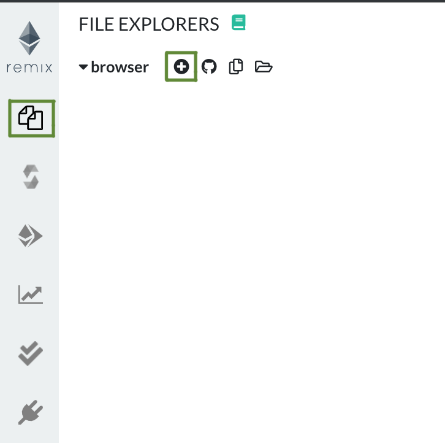
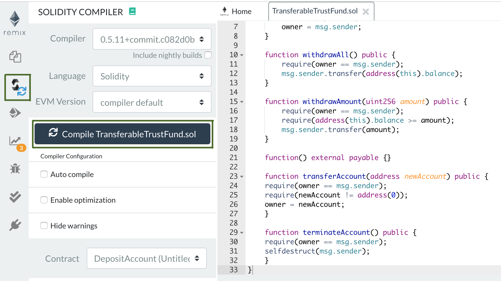
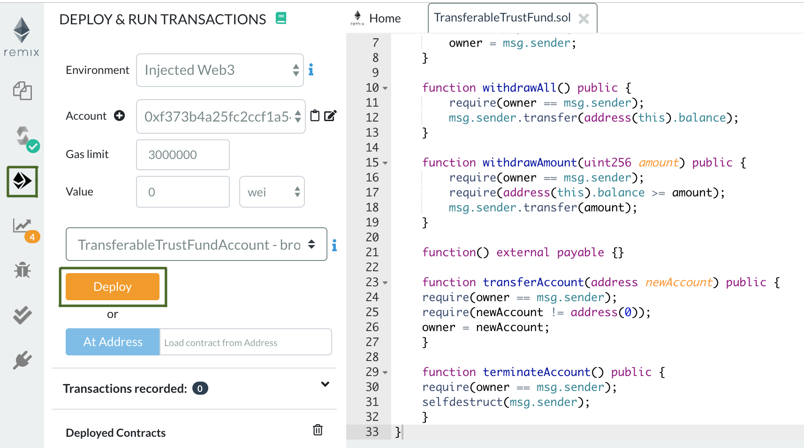
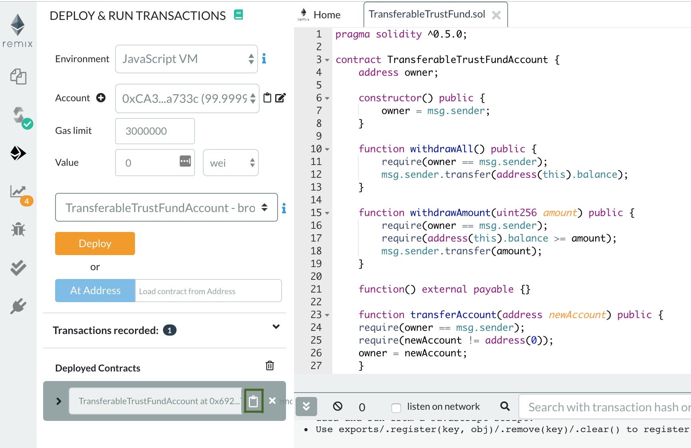
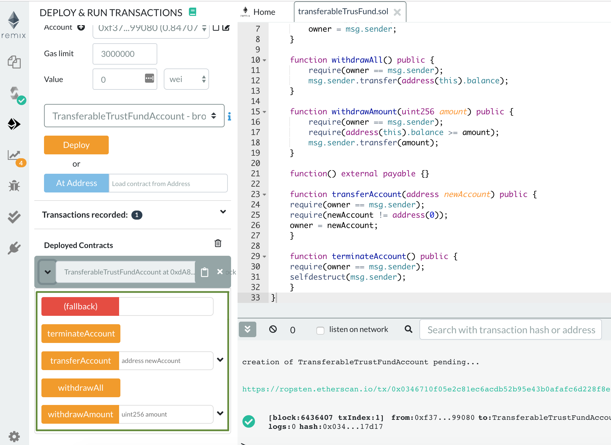

# Trust Fund account on Ethereum

Unlike with legacy finance systems where you need to rely on a well-established third party, you can build your own financial instrument on Ethereum.

The objective of this tutorial is to show how easy it is to build and run your own instance of a simple decentralized finance example, or DeFi.

In this tutorial, you will:

* Create a basic Trust Fund account smart contract with the following interaction options:
  * fund the account from any Ethereum address;
  * withdraw all funds from the account only from the account owner address;
  * withdraw partial funds from the account only from the account owner address;
  * transfer the account ownership to any Ethereum address;
  * terminate the account and get the balance back to the owner.

* Compile the smart contract with Remix IDE.
* Deploy the smart contract to Ethereum Ropsten testnet through a Chainstack node.
* Interact with the smart contract through Remix IDE and a Chainstack node.

::: tip Ethereum Ropsten testnet
For illustration purposes, this tutorial uses Ethereum Ropsten testnet.

For Ethereum mainnet, the steps are exactly the same, except that you would need to use mainnet ether.
:::

## Prerequisites

* [Chainstack](https://console.chainstack.com/) account to deploy an Ethereum node.
* [Remix IDE](https://remix.ethereum.org/) to compile the contract and deploy through MetaMask.
* [MetaMask](https://metamask.io/) to deploy the contract through Chainstack node and interact with the contract.

## Overview

To get from zero to a deployed Trust Fund account on the Ethereum Ropsten, do the following:

1. With Chainstack, create a [Public chain project](/glossary/public-chain-project).
1. With Chainstack, join the Ethereum Ropsten testnet.
1. With Chainstack, access your Ethereum node credentials.
1. Set up your MetaMask to work through a Chainstack node.
1. With Remix IDE, create and compile the Trust Fund smart contract.
1. Set up your Remix IDE to work through a Chainstack node.
1. With Remix IDE, deploy the contract to Ethereum Ropsten testnet.
1. With Remix IDE, interact with the contract on Ethereum Ropsten testnet.

## Step-by-step

### Create a Public chain project

See [Create a project](/platform/create-a-project).

### Join the Ethereum Ropsten testnet

See [Join a public network](/platform/join-a-public-network).

### Get your Ethereum node access and credentials

See [View node access and credentials](/platform/view-node-access-and-credentials).

### Set up MetaMask

See [Using MetaMask with Chainstack](/operations/ethereum/using-metamask-with-chainstack).

Having set up your MetaMask to interact through a Chainstack node, your Remix IDE will also interact with the network through a Chainstack node.

Create at least two accounts in MetaMask. You need two accounts to transfer the contract ownership from one to another.

In your MetaMask, fund each account with Ropsten ether by clicking **Deposit** > **Test Faucet** > **Get Ether**.

### Create and compile the Trust Fund smart contract

1. Open [Remix IDE](https://remix.ethereum.org/)

2. On the home page, click **Environments** > **Solidity**:


3. On the left pane, click **File explorers** > plus sign:



4. In the modal, give any name to your contract. For example, `transferableTrustFund.sol`.

5. Put in the contract code:

``` js
pragma solidity ^0.5.0;

contract TransferableTrustFundAccount {
    address owner;

    constructor() public {
        owner = msg.sender;
    }

    function withdrawAll() public {
        require(owner == msg.sender);
        msg.sender.transfer(address(this).balance);
    }

    function withdrawAmount(uint256 amount) public {
        require(owner == msg.sender);
        require(address(this).balance >= amount);
        msg.sender.transfer(amount);
    }

    function() external payable {}

    function transferAccount(address newAccount) public {
    require(owner == msg.sender);
    require(newAccount != address(0));
    owner = newAccount;
    }

    function terminateAccount() public {
    require(owner == msg.sender);
    selfdestruct(msg.sender);
    }
}
```

This is your Trust Fund account smart contract:

* The contract belongs to the Ethereum account that deploys the contract through:

``` js
contract TransferableTrustFundAccount {
    address owner;
```

* Only the contract owner can withdraw all funds from the contract through:

``` js
function withdrawAll() public {
        require(owner == msg.sender);
        msg.sender.transfer(address(this).balance);
    }
```

* Only the contract owner can withdraw partial funds from the contract through:

``` js
function withdrawAmount(uint256 amount) public {
        require(owner == msg.sender);
        require(address(this).balance >= amount);
        msg.sender.transfer(amount);
    }
```

* Anyone can deposit funds to the contract through:

``` js
function() external payable {}
```

* Only the contract owner can transfer the contract ownership to any other Ethereum account through:

``` js
function transferAccount(address newAccount) public {
    require(owner == msg.sender);
    require(newAccount != address(0));
    owner = newAccount;
    }
```

* Only the contract owner can terminate the contract and return all funds to the current owner through:

``` js
 function terminateAccount() public {
    require(owner == msg.sender);
    selfdestruct(msg.sender);
    }
```

6. Compile the contract:

On the left pane, click **Solidity compiler** > **Compile**:



### Set up Remix IDE to work through your Chainstack node

On the left pane, click **Deploy** and switch to **Injected Web3**:


This will engage your MetaMask and interact with the network through the Chainstack node provided in MetaMask.

### Deploy the Trust Fund smart contract

On the left pane, click **Deploy & run transactions** > **Deploy**:



This will engage your MetaMask to deploy the contract to Ethereum Ropsten testnet through your currently selected MetaMask account. Click **Confirm** in the MetaMask modal.

### Interact with the Trust Fund smart contract

Once the contract is deployed, fund the contract:

1. Copy the contract address under **Deployed Contracts**:



2. Open your MetaMask and send Ropsten ether to the copied contract address.

Now that your contract is funded, you can interact with it.

Expand the contract under **Deployed Contracts**:



* `withdrawAmount` — enter any amount that is less than the current contract balance to withdraw partial funds.
* `withdrawAll` — click to withdraw all funds from the contract.
* `transferAccount` — enter any Ethereum address to transfer the contract ownership. For this example, enter the address of your second account in MetaMask.
* `terminateAccount` — click to terminate the account and have the remaining funds returned to the current contract owner.

::: tip See also

* [Operations: Ethereum](/operations/ethereum/)
* [Using MetaMask with Chainstack](/operations/ethereum/using-metamask-with-chainstack)
* [Asset tokenization on Ethereum](/tutorials/asset-tokenization-on-ethereum)
* [Academic certificates on Ethereum](/tutorials/academic-certificates-on-ethereum)

:::
